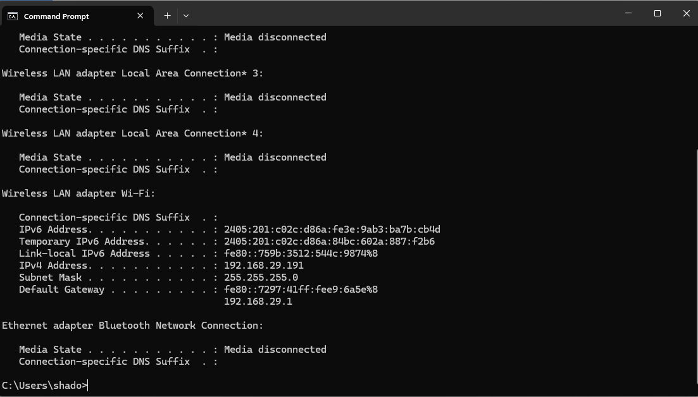
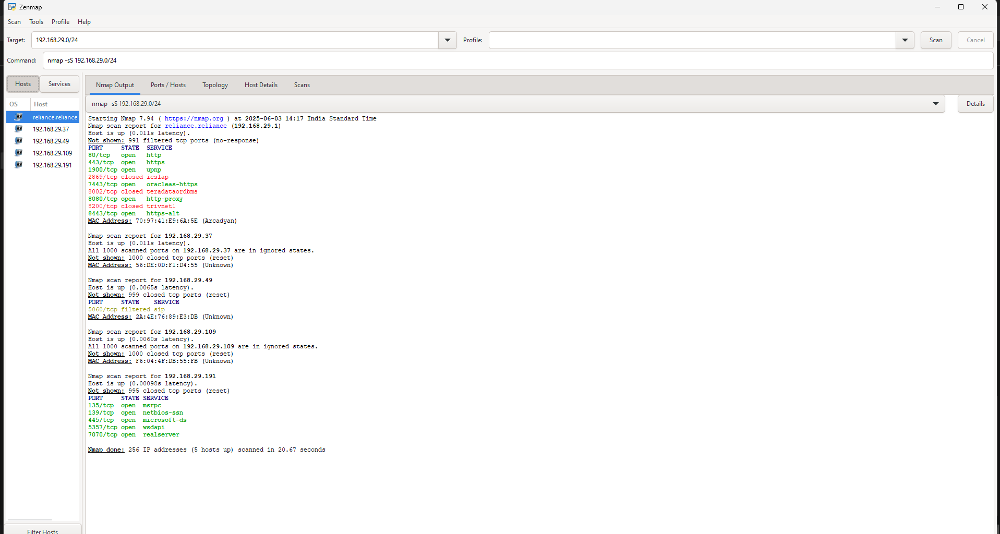

# Cyber Security Internship - Task 1: Local Network Port Scan

## Objective

The objective of this task was to learn how to discover open ports on devices within my local network to understand network exposure. This involved using Nmap to perform a TCP SYN scan and then analyzing the results to identify common services and potential security risks.

## Tools Used

* **Nmap:** A free and open-source network scanner used for network discovery and security auditing.
* **Zenmap:** The official Nmap GUI, used for easier execution and visualization of scan results.

## Methodology

1.  **Identified Local IP Range:**
    I first determined my local IP address using `ipconfig` (on Windows). My IPv4 address was `192.168.29.191`, which indicated that my local network range is `192.168.29.0/24`.

    

2.  **Performed TCP SYN Scan with Nmap:**
    Using Zenmap, I executed a TCP SYN scan (`nmap -sS`) across my identified local network range (`192.168.29.0/24`). This type of scan attempts to establish a connection without completing the full TCP handshake, making it stealthier and efficient for identifying open ports.

    

3.  **Analyzed Scan Results:**
    After the scan completed, I analyzed the Nmap output to identify active hosts and their open ports. The scan results were saved as an XML file.

    [Nmap Scan XML Output](scan.xml)

## Scan Results Summary

The following active hosts and their open ports were identified on the `192.168.29.0/24` network:

### Host: `192.168.29.1` (Likely Router/Gateway)

* **Open Ports:**
    * `80/tcp`
    * `443/tcp`
    * `1900/udp`
    * `5357/tcp`
    * `7070/tcp`

### Host: `192.168.29.191` (My Machine)

* **Open Ports:**
    * `135/tcp`
    * `139/tcp`
    * `445/tcp`
    * `5357/tcp`
    * `7070/tcp`

### Other Hosts (e.g., `192.168.29.27`, `192.168.29.49`, `192.168.29.109`)

* These hosts showed no open ports or had all scanned ports in filtered/ignored states, indicating they might be firewalled or unresponsive to the scan.

## Common Services Running on Open Ports (Deliverable 6)

Here's a breakdown of the common services associated with the identified open ports:

* **Port 80 (HTTP):** Hypertext Transfer Protocol, used for unencrypted web traffic.
* **Port 443 (HTTPS):** Hypertext Transfer Protocol Secure, used for encrypted web traffic.
* **Port 1900 (UPnP):** Universal Plug and Play, used for automatic network device discovery and configuration.
* **Port 135 (MSRPC):** Microsoft Remote Procedure Call, used for interprocess communication on Windows.
* **Port 139 (NetBIOS-SSN):** NetBIOS Session Service, used for file and printer sharing over NetBIOS.
* **Port 445 (Microsoft-DS / SMB):** Server Message Block, primarily used for file/printer sharing and remote administration on Windows.
* **Port 5357 (WSDAPI):** Web Services for Devices API, used for network discovery of devices.
* **Port 7070 (RealServer):** Commonly associated with RealNetworks RealSystem applications for streaming media.

## Potential Security Risks from Open Ports (Deliverable 7)

Open ports, while necessary for network functionality, can pose security risks if not properly managed. Here are potential risks associated with the identified open ports:

* **Ports 80/443 (HTTP/HTTPS):** Vulnerable to web application attacks (e.g., SQL injection, XSS) if web servers are not patched or securely configured. Unencrypted HTTP (Port 80) can expose sensitive data.
* **Port 1900 (UPnP):** Known for historical vulnerabilities that could allow attackers to bypass NAT, expose internal services, or even execute arbitrary code. Often recommended to disable if not essential.
* **Ports 135, 139, 445 (MSRPC, NetBIOS, SMB):** Highly targeted by malware (e.g., WannaCry, NotPetya via EternalBlue vulnerability). Misconfigurations can lead to unauthorized file/printer access. Weak credentials on SMB shares can lead to data breaches.
* **Port 5357 (WSDAPI):** While less critical than SMB, unpatched vulnerabilities in the WSDAPI could potentially be exploited for denial-of-service or information disclosure.
* **Port 7070 (RealServer):** Outdated or unpatched streaming media servers can have known vulnerabilities, potentially allowing remote code execution or denial of service.

## How Open Ports Can Be Secured (Covering Task Question 5)

Securing open ports is crucial for reducing a network's attack surface. Here are common methods:

* **Firewall Rules:** Implement strict firewall rules (both host-based and network-based) to only allow necessary traffic to specific ports and IP addresses. Deny all other incoming connections by default.
* **Patch Management:** Regularly update and patch all operating systems, applications, and network devices to fix known vulnerabilities associated with open services.
* **Principle of Least Privilege:** Only open ports that are absolutely essential for business operations. Close or disable any unnecessary services.
* **Strong Authentication:** For services that require access (e.g., SSH, RDP), enforce strong, unique passwords and multi-factor authentication (MFA).
* **Network Segmentation:** Divide the network into smaller segments (VLANs) to limit the lateral movement of attackers if one segment is compromised.
* **Intrusion Detection/Prevention Systems (IDS/IPS):** Deploy IDS/IPS to monitor network traffic for suspicious activity and block malicious connections.
* **VPN for Remote Access:** For remote access to internal services, use a Virtual Private Network (VPN) to encrypt traffic and provide a secure tunnel.

## Firewall's Role Regarding Ports (Covering Task Question 6)

A firewall acts as a security guard for a network, controlling incoming and outgoing network traffic based on a set of predefined security rules. Its primary roles regarding ports include:

* **Filtering Traffic:** Firewalls inspect network packets and decide whether to allow or block them based on source IP, destination IP, port number, and protocol.
* **Blocking Unwanted Access:** They can prevent unauthorized external access to internal services by blocking connections to specific ports. For example, a firewall can block all incoming connections to Port 22 (SSH) from the internet while allowing it only from specific administrative IPs.
* **Network Address Translation (NAT):** Many firewalls perform NAT, which hides internal IP addresses from the public internet, adding a layer of security by making it harder for external attackers to directly target internal hosts.
* **Stateful Inspection:** Modern firewalls use stateful inspection to track the state of active connections, allowing legitimate response traffic while blocking unsolicited incoming traffic.

## Conclusion

This task provided valuable hands-on experience with network reconnaissance using Nmap. By identifying open ports and understanding the services running on them, I gained insight into potential network exposures and the importance of implementing robust security measures to protect against common vulnerabilities.
